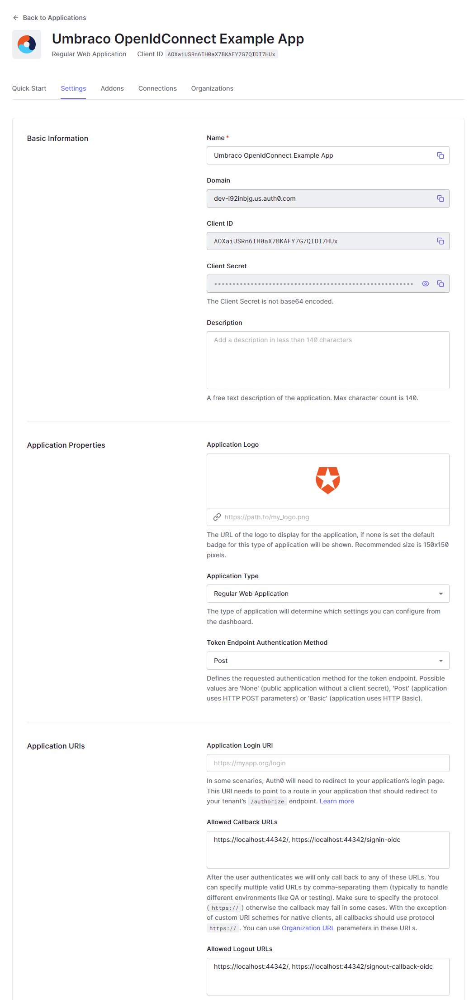

# Umbraco OpenID Connect example package

This example shows how OpenID Connect can be used for members in Umbraco. It's a complete Umbraco solution with a SQLite database. Everything is already configured correct so you can just download the project and run it. 

It's based on the external login providers documentation:<br />
https://our.umbraco.com/documentation/reference/security/external-login-providers/

## Getting started
You can watch a getting started video here: https://www.jeroenbreuer.nl/

<a href="./425x250.png" target="_blank"></a>

## Important files

All important files that are used for this setup are in the ```Umbraco-OpenIdConnect-Example.Core``` project.

1. <a href="./Umbraco-OpenIdConnect-Example.Core/Provider/OpenIdConnectMemberExternalLoginProviderOptions.cs" target="_blank">OpenIdConnectMemberExternalLoginProviderOptions.cs</a><br />
This file is used to setup the auto link options.
2. <a href="./Umbraco-OpenIdConnect-Example.Core/Extensions/UmbracoBuilderExtensions.cs" target="_blank">UmbracoBuilderExtensions.cs</a><br />
Extensions used to setup OpenID Connect and the related events.
3. <a href="./Umbraco-OpenIdConnect-Example.Core/Controllers/ExternalLogoutController.cs" target="_blank">ExternalLogoutController.cs</a><br />
A new controller used for logout on the external login provider.

## Auth0
There is a free Auth0 account that this project connects with. The Client ID and Client Secret are already configured for that. Normally the Client Secret should not be in Github, but these settings are only used in this example so it's ok they are public. This is the project:

<a href="./auth0.png" target="_blank"></a>